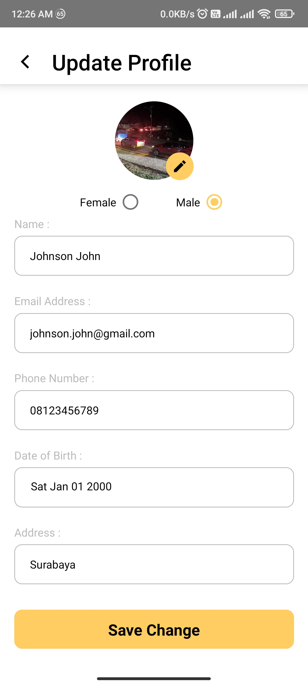

# Rental King Motor Mobile

This is source code for Rental King Motor Mobile app, specifically for Android. A vehicle rent app for everyone to use!

## Built With

---

[](https://reactnative.dev)

- [Node](https://nodejs.org/en/)
- [Yarn](https://yarnpkg.com/)

## Optional Requirements

- Android device for testing or [Android Studio](https://developer.android.com/studio).

### Installaton

---

1. Download this Project or you can type

```
git clone https://github.com/sulthanqintara/rental_king_mobile
```

2. To install all the dependencies package, open terminal or CMD on the app's directory and type:

```
yarn install
```


3. Add .env at the root of the project's folder

```javascript
API_URL = 'https://rental-king-db.herokuapp.com'; //or to your local backend
MYAPP_UPLOAD_STORE_PASSWORD = your_store_password;
MYAPP_UPLOAD_KEY_PASSWORD = your_key_password;
```

4. Type on the terminal/CMD

```
yarn android
or
yarn start
```

5. Refer to [React Native's doc](https://reactnative.dev/docs/signed-apk-android) to build your app to be tested on other device.

## App's Images

---




### Related Projects

---

- [Rental King Motor Backend](https://github.com/sulthanqintara/Rental-King-Motor)
- [Rental King Motor Website](https://github.com/sulthanqintara/React-Rental-King-Motor)
